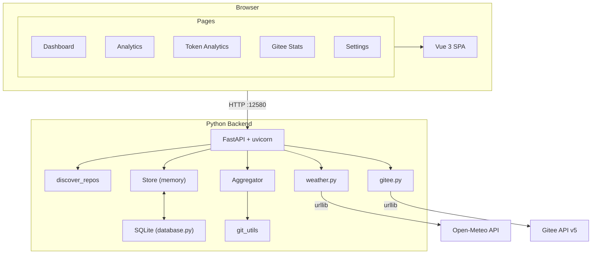

# GitStat // Netrunner Edition

<p align="center">
  
  
  
  
  
  
  
  
</p>

> **Git 仓库提交统计与可视化分析平台 — 赛博朋克增强版**
>
> Git Repository Commit Statistics & Visualization Platform — Cyberpunk Enhanced

**仓库地址：** https://github.com/KsongloveCv/gitstat-cyberpunk

---

## 📡 目录

- [项目简介](#-项目简介)
- [更新日志](#-更新日志)
- [核心特点](#-核心特点)
- [快速开始](#-快速开始)
- [配置说明](#-配置说明)
- [项目架构](#-项目架构)
- [API 接口](#-api-接口)
- [从源码运行](#-从源码运行)
- [Docker 部署](#-docker-部署)
- [前端开发](#-前端开发)
- [数据持久化](#-数据持久化)
- [常见问题](#-常见问题)
- [技术栈](#-技术栈)
- [项目结构](#-项目结构)
- [许可证](#-许可证)

---

## 📡 项目简介

GitStat Netrunner Edition 是一个 **本地 Git 仓库提交统计与可视化** 工具。基于 [gitstat](https://github.com/wsyqn6/gitstat) 增强开发，在原有暗色霓虹风格基础上，加入了 CRT 扫描线、Matrix 数字雨、全息投影动画、故障艺术效果等经典赛博朋克视觉元素。

**一条命令即可：**

1. 扫描本地目录下所有 Git 仓库
2. 启动 Web 仪表盘（默认 `http://localhost:12580`）
3. 查看提交趋势、作者排行、活动热力图、天气、Token 消耗、Gitee 仓库管理等

**设计原则：**

- 不依赖 GitHub/Gitee API 读取提交历史（直接 `git log`）
- 后端单进程部署，前端静态资源由 FastAPI 托管
- 支持 SQLite 本地缓存，重启后快速恢复扫描状态

---

## 📡 更新日志

### v2.1.0 — 数据可靠性 + 体验修复（当前版本）

| 类别 | 变更 |
|------|------|
| **扫描路径** | 新增 `resolve_scan_path()`：目录下无 Git 仓库时自动向上查找父目录；启动时优先恢复数据库中有效的扫描路径 |
| **SQLite 修复** | 修正 `load_commits` 列索引错误（`date` 字段误读为 `email`），修复提交时间筛选不准的问题 |
| **缓存一致性** | 切换扫描路径时同步清理 SQLite 仓库/提交缓存；仅从 DB 恢复当前扫描范围内的仓库 |
| **天气卡片** | 修复 `WeatherCard` 数据源绑定错误（应从 `weatherState` 读取，而非 `data.js`） |
| **Token 预算** | 修复预算设置 API 的 `BaseModel` 未定义导致服务崩溃的问题 |
| **模块化** | 后端拆分为 `database.py` / `store.py` / `git_utils.py` / `gitee.py` / `weather.py` / `config.py` |

### v2.0 — 赛博朋克增强版（重大重构 + 新功能）

**架构重构：**

- 移除 Go 后端（约 2600 行），统一为 Python/FastAPI
- 天气 API 通过 `urllib.request` 代理 Open-Meteo，零额外 HTTP 依赖
- 前端 `dist/` 由 FastAPI SPA fallback 直接服务

**新增功能：**

| 功能 | 说明 |
|------|------|
| **天气卡片** | 浏览器定位（拒绝时回退上海），当前天气 + 7 天预报，Open-Meteo 免费 API |
| **今日提交详情** | 详细提交列表：哈希、消息、作者、仓库、相对时间、+/- 行数、变更条 |
| **连续贡献天数** | Streak 统计：当前连续天数 + 历史最长连续天数 |
| **Token 分析** | 效率指标、成本预测、时段对比、对话 Top10、热力图、预算管理 |
| **Gitee 管理** | 浏览/克隆/分析/移除 Gitee 仓库 |
| **SQLite 持久化** | 扫描路径、仓库元数据、提交记录本地缓存 |

---

## ✦ 核心特点

### 使用体验

| 特性 | 说明 |
|------|------|
| **轻量部署** | `pip install` + `python main.py` 即可运行 |
| **全离线 Git 分析** | 直接解析 `git log --numstat`，无需联网 |
| **惰性加载** | 按需拉取 commit，大仓库快速启动 |
| **增量更新** | 已初始化仓库仅补拉新增提交 |
| **中英双语** | 完整 i18n，自动检测浏览器语言 |
| **天气集成** | 基于定位显示实时天气与 7 日预报 |

### 赛博朋克视觉

| 效果 | 描述 |
|------|------|
| CRT 扫描线 | 全局复古显示器叠加层 |
| Matrix 数字雨 | 可开关 Canvas 背景动画 |
| 霓虹发光 | 文字/边框/阴影三重 glow |
| Glitch 故障字 | LOGO 悬停 RGB 通道分离 |
| 全息卡片 | 悬停扫描线 + 四角霓虹灯 |
| Boot Sequence | 首次访问终端打字机动画 |
| 三套主题 | Cyan/Magenta · Amber · Green |
| 霓虹滚动条 | 渐变 thumb，hover 变色 |

### 数据分析

| 页面 | 能力 |
|------|------|
| **仪表盘** | 天气、今日概览、Streak、周趋势、作者榜、仓库对比、今日提交列表 |
| **分析中心** | 日/周/月/年维度、多仓库筛选、热力图、日历视图 |
| **Token 分析** | 模型消耗、效率、成本预测、预算告警 |
| **Gitee** | 远程仓库浏览与本地克隆管理 |
| **仓库详情** | 分支、语言、行数、贡献者、近期提交 |
| **设置** | 扫描路径配置、JSON 数据导出 |

---

## ✦ 快速开始

### 1. 安装依赖

```bash
pip3 install -r backend-py/requirements.txt
```

### 2. 构建前端（首次运行必须）

```bash
cd frontend && npm install && npm run build && cd ..
```

### 3. 启动服务

```bash
# 扫描指定目录（推荐指向包含多个仓库的父目录）
python3 backend-py/main.py ~/your-git-projects

# 扫描当前目录
python3 backend-py/main.py .

# 自定义端口 / 不自动打开浏览器
python3 backend-py/main.py ~/projects --port 8080 --no-browser
```

### 4. 打开浏览器

访问 **http://localhost:12580**

> **推荐扫描路径示例：** 若项目在 `~/projects/my-app/` 下，建议扫描 `~/projects/` 以包含所有子仓库，而非 `my-app/frontend/` 等无 `.git` 的子目录。

### 交互提示

- 首次访问：Boot Sequence 动画，点击任意处跳过
- 导航栏 `≋`：开关 Matrix 数字雨
- 顶部 `GITSTAT` LOGO：切换霓虹主题
- 天气卡片：自动定位，拒绝时回退上海（31.23°N, 121.47°E）
- 数据刷新：设置页修改扫描路径后点击「开始扫描」

### 命令行参数

```
python3 backend-py/main.py [scan_path] [options]

参数:
  scan_path              扫描目录（默认: 当前工作目录）
  --port NUMBER          监听端口（默认: 12580）
  --no-browser           不自动打开浏览器
```

---

## ✦ 配置说明

### 环境变量

| 变量 | 默认值 | 说明 |
|------|--------|------|
| `GITEE_TOKEN` | 空 | Gitee API 私人令牌，用于提高 Gitee 接口速率上限 |

```bash
export GITEE_TOKEN=your_gitee_personal_access_token
python3 backend-py/main.py ~/projects
```

### 本地数据目录

| 路径 | 内容 |
|------|------|
| `~/.gitstat/gitstat.db` | SQLite 数据库（扫描路径、仓库元数据、提交缓存） |
| `~/.gitstat-gitee-cache/` | Gitee 克隆缓存目录 |
| `~/.hermes/token_budget.json` | Token 月度预算配置 |

### 扫描路径行为

1. **启动时**：优先使用数据库中已保存且仍含仓库的路径
2. **路径无效时**：自动向上查找父目录（最多 5 层），直到发现 Git 仓库
3. **设置页修改路径**：清空内存与 SQLite 仓库缓存，重新注册发现的仓库

---

## ✦ 项目架构



**数据流：**

1. `discover_repos` 扫描目录 → 发现所有 `.git` 仓库（当前目录 + 一级子目录）
2. `store` 内存管理仓库列表，支持懒加载 commit
3. `git log --numstat` 解析提交记录（作者、时间、+/- 行数）
4. `aggregator` 按时间/作者/仓库维度聚合
5. `database` 持久化扫描路径、仓库元数据、提交记录
6. FastAPI 提供 REST API + 静态文件 SPA fallback
7. 天气经后端代理 Open-Meteo（规避浏览器 CORS）

---

## ✦ API 接口

### 扫描与仓库

| Method | Endpoint | 说明 |
|--------|----------|------|
| `POST` | `/api/scan/path` | 设置扫描目录（body: `{"path": "/abs/path"}`） |
| `GET` | `/api/scan/path` | 获取当前扫描目录与 Git 版本 |
| `GET` | `/api/repositories` | 仓库列表（轻量元数据） |
| `GET` | `/api/repos/list` | 仓库详细信息列表 |
| `GET` | `/api/repos/info?path=` | 单个仓库信息 |
| `GET` | `/api/repos/stats?path=` | 仓库统计 |
| `POST` | `/api/repos/analyze` | 深度分析（语言/分支/行数） |

### 统计接口

| Method | Endpoint | 主要参数 | 说明 |
|--------|----------|----------|------|
| `GET` | `/api/stats/overview` | `range`, `repo`, `email` | 总览统计 |
| `GET` | `/api/stats/daily` | `range=today\|week\|month` | 每日统计 |
| `GET` | `/api/stats/weekly` | `range`, `repo` | 每周统计 |
| `GET` | `/api/stats/monthly` | `range`, `repo` | 每月统计 |
| `GET` | `/api/stats/yearly` | `range`, `repo` | 每年统计 |
| `GET` | `/api/stats/authors` | `range`, `repo` | 作者排行 |
| `GET` | `/api/stats/activity-heatmap` | `repo`, `startDate`, `endDate` | 活动热力图 |
| `GET` | `/api/stats/repo-comparison` | `range`, `repo` | 仓库对比 |
| `GET` | `/api/stats/commit-list` | `range`, `limit`, `repo` | 提交详情列表（时间倒序） |
| `GET` | `/api/stats/streak` | `repo` | 连续贡献天数 |
| `GET` | `/api/stats/tokens` | `range`, `model` | Token 消耗统计 |
| `GET` | `/api/stats/tokens/budget` | — | 查询月度预算与已用额度 |
| `POST` | `/api/stats/tokens/budget` | `{"monthlyBudget": 100}` | 设置月度预算 |

**`range` 常用值：** `today` · `week` · `month` · `year` · `thisWeek` · `lastWeek` · `thisMonth` · `thisYear`

### 天气接口

| Method | Endpoint | 参数 | 说明 |
|--------|----------|------|------|
| `GET` | `/api/weather/current` | `lat`, `lon` | 当前天气 |
| `GET` | `/api/weather/forecast` | `lat`, `lon`, `days=7` | 天气预报 |

数据来源：[Open-Meteo](https://open-meteo.com/)（免费、无需 API Key）

### Gitee 仓库管理

| Method | Endpoint | 说明 |
|--------|----------|------|
| `GET` | `/api/gitee/repos` | 搜索/浏览仓库 |
| `GET` | `/api/gitee/repos/info` | 仓库详情 |
| `POST` | `/api/gitee/repos/clone` | 克隆到本地 |
| `POST` | `/api/gitee/repos/analyze` | 深度分析 |
| `POST` | `/api/gitee/repos/remove` | 移除本地克隆 |

### 其他

| Method | Endpoint | 说明 |
|--------|----------|------|
| `POST` | `/api/export/json` | 导出 JSON |
| `GET` | `/api/version` | 版本号 |
| `GET` | `/health` | 健康检查 |

---

## ✦ 从源码运行

### 前置要求

| 依赖 | 版本 |
|------|------|
| Python | ≥ 3.9 |
| Node.js | ≥ 22 |
| Git | 命令行可用 |
| pip | 用于安装后端依赖 |

### 完整流程

```bash
git clone https://github.com/KsongloveCv/gitstat-cyberpunk.git
cd gitstat-cyberpunk

# 后端依赖
pip3 install -r backend-py/requirements.txt

# 前端构建
cd frontend
npm install
npm run build
cd ..

# 启动（将路径替换为你的 Git 项目父目录）
python3 backend-py/main.py ~/your-git-projects
```

### 开发模式

**前端热更新：**

```bash
cd frontend
npm run dev    # 默认 http://localhost:5173
```

**后端 API：**

```bash
python3 backend-py/main.py ~/your-git-projects --no-browser
```

> 开发模式下需同时运行 Vite dev server 与 Python 后端，或将前端 proxy 指向 `:12580`。

---

## ✦ Docker 部署

```bash
# 先构建前端
cd frontend && npm install && npm run build && cd ..

# 构建镜像
docker build -t gitstat-cyberpunk .

# 运行（挂载本地 Git 项目目录）
docker run -p 12580:12580 \
  -v ~/your-git-projects:/data \
  -e GITEE_TOKEN=your_token \
  gitstat-cyberpunk \
  python backend-py/main.py /data --no-browser
```

---

## ✦ 前端开发

### 状态管理（Pinia 风格自研 Store）

| 文件 | 职责 |
|------|------|
| `stores/data.js` | Git 统计数据、扫描路径、提交列表、仓库缓存 |
| `stores/weather.js` | 天气数据（current / forecast / loading / error） |

> **注意：** `WeatherCard.vue` 必须绑定 `weatherState`（`stores/weather.js`），`Dashboard.vue` 在 `onMounted` 时调用 `fetchWeather()` 加载数据。

### 组件树

```
App.vue
├── MatrixRain.vue
├── BootSequence.vue
├── views/
│   ├── Dashboard.vue
│   │   ├── WeatherCard.vue      # 天气（当前 + 7天）
│   │   ├── StatCard.vue         # 统计卡片
│   │   └── StreakCard.vue       # 连续贡献
│   ├── Analytics.vue
│   ├── TokenAnalytics.vue
│   │   ├── TokenEfficiencyCards.vue
│   │   ├── TokenComparison.vue
│   │   ├── TokenHeatmapCalendar.vue
│   │   └── TokenBudgetAlert.vue
│   ├── GiteeStats.vue
│   ├── RepoSection.vue
│   └── Settings.vue
├── api/index.js                 # 统一 API 层
├── utils/constants.js           # 色板 + 天气 emoji 映射
└── i18n.js                      # 中英文
```

### 主题切换

点击 LOGO 循环三套配色：

| 主题 | cyan | magenta |
|------|------|---------|
| Default | `#00f5ff` | `#ff00ff` |
| Amber | `#ffb800` | `#ff6600` |
| Green | `#00ff88` | `#00ffcc` |

---

## ✦ 数据持久化

GitStat 使用 SQLite（`~/.gitstat/gitstat.db`）缓存以下数据：

| 表 | 内容 |
|----|------|
| `scan_state` | 上次扫描路径 |
| `repos` | 仓库元数据（分支数、语言、行数等） |
| `commits` | 已加载的提交记录 |

**生命周期：**

- 首次访问某仓库统计 API → 触发 `git log` 拉取 → 写入 SQLite
- 重启服务 → 从 SQLite 恢复扫描路径与已缓存仓库
- 切换扫描路径 → 清空 `repos` + `commits` 表，重新发现仓库

**清理缓存：**

```bash
rm -f ~/.gitstat/gitstat.db
# 重启服务后将重新扫描
```

---

## ✦ 常见问题

### 仪表盘数据全为 0？

1. 检查顶部扫描路径是否指向含 `.git` 的目录
2. 进入 **设置** 页，将路径改为 Git 项目父目录（如 `~/projects` 而非 `~/projects/app/frontend`）
3. 点击「开始扫描」
4. 强制刷新浏览器（`Cmd+Shift+R` / `Ctrl+Shift+R`）

### 天气卡片不显示？

1. 确认已执行 `npm run build` 且后端加载了最新 `frontend/dist/`
2. 强制刷新浏览器清除 JS 缓存
3. 检查 `/api/weather/current?lat=31.23&lon=121.47` 是否返回 200

### 今日提交列表为空但概览有数据？

- 提交列表使用 `/api/stats/commit-list?range=today`，需等待页面滚动到下半区触发加载
- 确认扫描路径覆盖目标仓库

### 端口 12580 被占用？

```bash
lsof -i :12580 -t | xargs kill
python3 backend-py/main.py ~/projects --no-browser
```

---

## ✦ 技术栈

| 层级 | 技术 | 说明 |
|------|------|------|
| 后端 | Python 3.9+ / FastAPI | 异步 REST API |
| 服务器 | uvicorn | ASGI |
| 持久化 | SQLite (WAL) | 本地缓存 |
| 数据源 | git log --numstat | 离线解析 |
| 天气 | Open-Meteo + urllib | 免费代理 |
| Gitee | Gitee API v5 | 可选 Token |
| 前端 | Vue 3.5 Composition API | `<script setup>` |
| 构建 | Vite 8 | HMR + Rollup |
| 图表 | ECharts 6 | 按需引入 |
| 字体 | Orbitron / Rajdhani / Share Tech Mono | Google Fonts |
| i18n | 自研 composable | zh / en |

---

## ✦ 项目结构

```
gitstat-cyberpunk/
├── README.md
├── LICENSE
├── Dockerfile
├── backend-py/
│   ├── main.py           # FastAPI 入口、路由注册、启动逻辑
│   ├── database.py       # SQLite 持久化层
│   ├── store.py          # 内存仓库缓存（线程安全）
│   ├── git_utils.py      # git 命令封装与 log 解析
│   ├── gitee.py          # Gitee API 集成
│   ├── weather.py        # Open-Meteo 天气代理
│   ├── config.py         # 版本号、超时、路径配置
│   └── requirements.txt
├── frontend/
│   ├── src/
│   │   ├── App.vue
│   │   ├── views/        # Dashboard / Analytics / Token / Gitee / Settings
│   │   ├── components/   # WeatherCard / StreakCard / StatCard / ...
│   │   ├── stores/       # data.js + weather.js
│   │   ├── api/index.js
│   │   ├── utils/
│   │   └── i18n.js
│   ├── dist/             # 构建产物（需 npm run build 生成）
│   └── package.json
└── docs/
```

---

## ✦ 许可证

本项目基于 [gitstat](https://github.com/wsyqn6/gitstat) 增强开发，使用 [MIT License](LICENSE)。

---

<p align="center">
  <em>"The street finds its own uses for things."</em><br>
  — William Gibson
</p>
