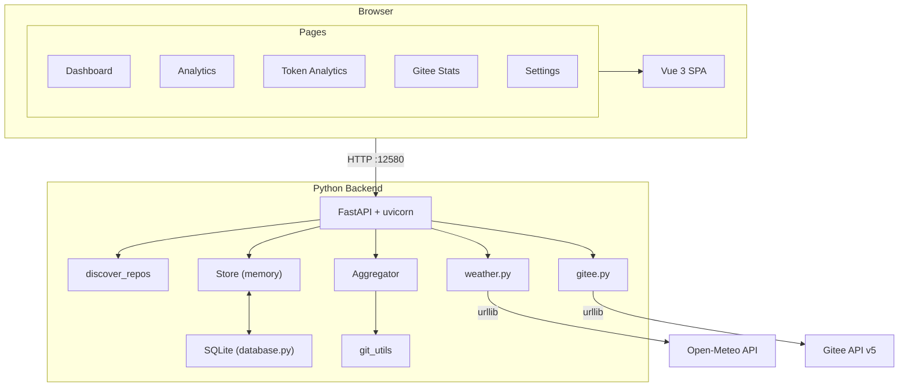

# GitStat Cyberpunk _(gitstat-cyberpunk)_

<p align="center">
  
  
  
  
  
  
  
  
</p>

Local Git repository commit statistics and visualization platform with cyberpunk UI enhancements.

## Table of Contents

- [About](#about)
- [Features](#features)
- [Install](#install)
- [Usage](#usage)
- [Configuration](#configuration)
- [Architecture](#architecture)
- [API](#api)
- [Development](#development)
- [Docker](#docker)
- [FAQ](#faq)
- [Contributing](#contributing)
- [Acknowledgments](#acknowledgments)
- [License](#license)

## About

GitStat Cyberpunk is a **local Git repository commit statistics and visualization** tool. It scans directories for Git repos, parses `git log --numstat` directly (no GitHub/Gitee API needed), and serves a cyberpunk-themed web dashboard at `http://localhost:12580`.

Based on [gitstat](https://github.com/wsyqn6/gitstat), this edition adds CRT scanlines, Matrix rain, neon glow, glitch effects, holo-card animations, weather integration, Token analytics, and Gitee repository management — all in a single-process Python/FastAPI deployment.

## Features

- **Zero-network Git analysis** — parses `git log` locally, works offline
- **Lazy loading** — commits fetched on demand, large repos start fast
- **Incremental updates** — only pulls new commits for known repos
- **SQLite persistence** — scan path, repo metadata, and commit cache survive restarts
- **Bilingual i18n** — zh / en, auto-detects browser language
- **Weather card** — browser geolocation + 7-day forecast via Open-Meteo (free, no API key)
- **Token analytics** — model consumption, efficiency metrics, cost prediction, budget alerts
- **Gitee management** — browse, clone, analyze, and remove Gitee repos
- **Cyberpunk visuals** — CRT scanlines, Matrix rain, neon glow, glitch logo, holo-cards, boot sequence, 3 theme presets (Cyan/Magenta, Amber, Green)
- **Single-process** — FastAPI serves REST API + static SPA, no separate web server needed

## Install

### Requirements

| Dependency | Version |
|------------|---------|
| Python | >= 3.9 |
| Node.js | >= 22 |
| Git | available on PATH |
| pip | for backend dependencies |

### Steps

```bash
git clone https://github.com/KsongloveCv/gitstat-cyberpunk.git
cd gitstat-cyberpunk

# Backend dependencies
pip3 install -r backend-py/requirements.txt

# Frontend build (required on first run)
cd frontend && npm install && npm run build && cd ..
```

## Usage

```bash
# Scan a directory containing Git repos
python3 backend-py/main.py ~/your-git-projects

# Scan current directory
python3 backend-py/main.py .

# Custom port / no browser
python3 backend-py/main.py ~/projects --port 8080 --no-browser
```

Open **http://localhost:12580** in a browser.

> Point the scan path at a parent directory (e.g. `~/projects/`) rather than a subdirectory without `.git`.

### CLI Arguments

| Argument | Default | Description |
|----------|---------|-------------|
| `scan_path` | current directory | Directory to scan for Git repos |
| `--port` | 12580 | HTTP listen port |
| `--no-browser` | auto-open | Skip automatic browser launch |

### Interaction Tips

- **Boot animation** — click anywhere to skip on first visit
- **Matrix rain** — toggle via nav bar `~` button
- **Theme** — click the `GITSTAT` logo to cycle Cyan/Magenta → Amber → Green
- **Weather** — auto-locates; falls back to Shanghai (31.23N, 121.47E) on denial
- **Data refresh** — change scan path in Settings, then click "Start Scan"

## Configuration

### Environment Variables

| Variable | Default | Description |
|----------|---------|-------------|
| `GITEE_TOKEN` | empty | Gitee API personal access token (raises rate limit) |

```bash
export GITEE_TOKEN=your_gitee_personal_access_token
python3 backend-py/main.py ~/projects
```

### Local Data Paths

| Path | Content |
|------|---------|
| `~/.gitstat/gitstat.db` | SQLite database (scan path, repo metadata, commit cache) |
| `~/.gitstat-gitee-cache/` | Gitee clone cache directory |
| `~/.hermes/token_budget.json` | Token monthly budget config |

### Scan Path Behavior

1. On startup: restores saved scan path from DB if it still contains Git repos
2. If path is invalid: walks up parent directories (max 5 levels) until Git repos are found
3. Changing path in Settings: clears repo + commit caches, re-discovers repos

### Clear Cache

```bash
rm -f ~/.gitstat/gitstat.db
# Restart to re-scan from scratch
```

## Architecture



**Data flow:**

1. `discover_repos` scans directory for `.git` repos (current + one-level subdirs)
2. `store` manages repo list in memory, supports lazy commit loading
3. `git log --numstat` parses commit records (author, time, +/- lines)
4. `aggregator` groups by time/author/repo dimensions
5. `database` persists scan path, repo metadata, commit records
6. FastAPI serves REST API + static SPA fallback
7. Weather proxied through backend (avoids browser CORS)

## API

### Scan & Repos

| Method | Endpoint | Description |
|--------|----------|-------------|
| `POST` | `/api/scan/path` | Set scan directory (`{"path": "/abs/path"}`) |
| `GET` | `/api/scan/path` | Current scan directory + Git version |
| `GET` | `/api/repositories` | Repo list (lightweight metadata) |
| `GET` | `/api/repos/list` | Detailed repo info |
| `GET` | `/api/repos/info?path=` | Single repo info |
| `GET` | `/api/repos/stats?path=` | Repo statistics |
| `POST` | `/api/repos/analyze` | Deep analysis (language/branches/lines) |

### Stats

All stats endpoints accept `range` (today, week, month, year, thisWeek, thisMonth, thisYear) and optional `repo`/`email` filters.

| Method | Endpoint | Description |
|--------|----------|-------------|
| `GET` | `/api/stats/overview` | Overview statistics |
| `GET` | `/api/stats/daily` | Daily statistics |
| `GET` | `/api/stats/weekly` | Weekly statistics |
| `GET` | `/api/stats/monthly` | Monthly statistics |
| `GET` | `/api/stats/yearly` | Yearly statistics |
| `GET` | `/api/stats/authors` | Author rankings |
| `GET` | `/api/stats/activity-heatmap` | Activity heatmap |
| `GET` | `/api/stats/repo-comparison` | Repo comparison |
| `GET` | `/api/stats/commit-list` | Commit detail list (time-desc) |
| `GET` | `/api/stats/streak` | Consecutive contribution days |
| `GET` | `/api/stats/tokens` | Token consumption stats |
| `GET` | `/api/stats/tokens/budget` | Monthly budget query |
| `POST` | `/api/stats/tokens/budget` | Set monthly budget (`{"monthlyBudget": 100}`) |

### Weather & Gitee

| Method | Endpoint | Description |
|--------|----------|-------------|
| `GET` | `/api/weather/current?lat=&lon=` | Current weather (Open-Meteo, free) |
| `GET` | `/api/weather/forecast?lat=&lon=&days=7` | Weather forecast |
| `GET` | `/api/gitee/repos` | Search/browse Gitee repos |
| `POST` | `/api/gitee/repos/clone` | Clone repo locally |
| `POST` | `/api/gitee/repos/analyze` | Deep analysis |
| `POST` | `/api/gitee/repos/remove` | Remove local clone |

### Other

| Method | Endpoint | Description |
|--------|----------|-------------|
| `POST` | `/api/export/json` | Export data as JSON |
| `GET` | `/api/version` | Version number |
| `GET` | `/health` | Health check |

## Development

### Dev Mode

Run Vite dev server and Python backend side by side:

```bash
# Frontend (HMR, http://localhost:5173)
cd frontend && npm run dev

# Backend (http://localhost:12580)
python3 backend-py/main.py ~/your-git-projects --no-browser
```

### State Management

| File | Responsibility |
|------|---------------|
| `stores/data.js` | Git stats, scan path, commit list, repo cache |
| `stores/weather.js` | Weather data (current/forecast/loading/error) |

### Component Tree

```
App.vue
 +-- MatrixRain.vue
 +-- BootSequence.vue
 +-- views/
      +-- Dashboard.vue (WeatherCard, StatCard, StreakCard)
      +-- Analytics.vue
      +-- TokenAnalytics.vue (EfficiencyCards, Comparison, HeatmapCalendar, BudgetAlert)
      +-- GiteeStats.vue
      +-- RepoSection.vue
      +-- Settings.vue
 +-- api/index.js
 +-- utils/constants.js
 +-- i18n.js
```

### Theme Presets

Click the logo to cycle:

| Theme | Cyan | Magenta |
|-------|------|---------|
| Default | `#00f5ff` | `#ff00ff` |
| Amber | `#ffb800` | `#ff6600` |
| Green | `#00ff88` | `#00ffcc` |

## Docker

```bash
# Build frontend first
cd frontend && npm install && npm run build && cd ..

# Build image
docker build -t gitstat-cyberpunk .

# Run (mount local Git project directory)
docker run -p 12580:12580 \
  -v ~/your-git-projects:/data \
  -e GITEE_TOKEN=your_token \
  gitstat-cyberpunk \
  python backend-py/main.py /data --no-browser
```

## FAQ

### Dashboard shows all zeros?

1. Check scan path points to a directory containing `.git` subdirs
2. Go to Settings, set path to a parent directory (e.g. `~/projects`)
3. Click "Start Scan", then force-refresh browser (`Cmd+Shift+R`)

### Weather card not showing?

1. Verify `npm run build` was run and backend loaded latest `frontend/dist/`
2. Force-refresh browser to clear JS cache
3. Check `/api/weather/current?lat=31.23&lon=121.47` returns 200

### Port 12580 occupied?

```bash
lsof -i :12580 -t | xargs kill
python3 backend-py/main.py ~/projects --no-browser
```

## Contributing

PRs are welcome. Please open an issue first to discuss what you want to change.

### Development Setup

```bash
git clone https://github.com/KsongloveCv/gitstat-cyberpunk.git
cd gitstat-cyberpunk
pip3 install -r backend-py/requirements.txt
cd frontend && npm install && npm run build && cd ..
```

### Running Tests

```bash
pytest tests/
```

## Acknowledgments

- Based on [gitstat](https://github.com/wsyqn6/gitstat) by wsyqn6
- Weather data from [Open-Meteo](https://open-meteo.com/) (free, no API key)
- Fonts: Orbitron, Rajdhani, Share Tech Mono via Google Fonts

## License

[MIT](LICENSE) - see the [LICENSE](LICENSE) file for details.

---

<p align="center">
  <em>"The street finds its own uses for things."</em><br>
  William Gibson
</p>
